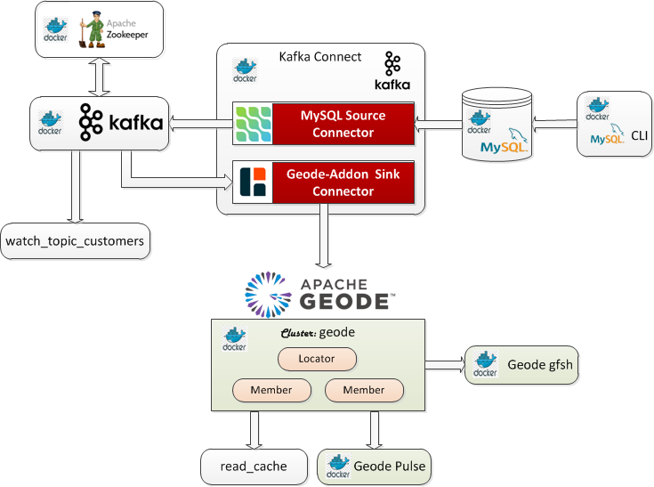
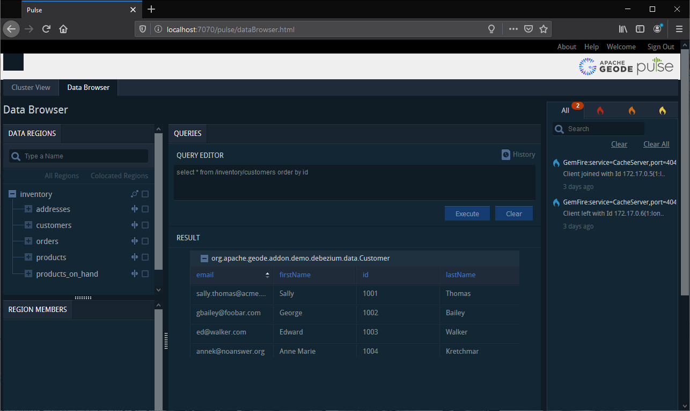

 [*PadoGrid*](https://github.com/padogrid) | [*Catalogs*](https://github.com/padogrid/catalog-bundles/blob/master/all-catalog.md) | [*Manual*](https://github.com/padogrid/padogrid/wiki) | [*FAQ*](https://github.com/padogrid/padogrid/wiki/faq) | [*Releases*](https://github.com/padogrid/padogrid/releases) | [*Templates*](https://github.com/padogrid/padogrid/wiki/Using-Bundle-Templates) | [*Pods*](https://github.com/padogrid/padogrid/wiki/Understanding-Padogrid-Pods) | [*Kubernetes*](https://github.com/padogrid/padogrid/wiki/Kubernetes) | [*Docker*](https://github.com/padogrid/padogrid/wiki/Docker) | [*Apps*](https://github.com/padogrid/padogrid/wiki/Apps) | [*Quick Start*](https://github.com/padogrid/padogrid/wiki/Quick-Start)

---

<!-- Platforms -->
[](https://github.com/padogrid/padogrid/wiki/Platform-PadoGrid-1.x) [](https://github.com/padogrid/padogrid/wiki/Platform-Host-OS)

# Debezium-Kafka Geode Connector

This bundle integrates Geode with Debezium for ingesting initial data and CDC records from MySQL into a Geode cluster via a Kafka sink connector included in the `padogrid` distribution. It supports inserts, updates and deletes.

## Installing Bundle

```bash
install_bundle -download bundle-geode-1-docker-debezium_kafka
```

❗ If you are running this bundle on WSL, make sure your workspace is on a shared folder. The Docker volume it creates will not be visible outside of WSL otherwise.

## Use Case

This use case ingests data changes made in the MySQL database into a Geode cluster via Kafka connectors: the Debezium MySQL source connector and the `geode-addon` Debezium sink connector.



## Required Software

- Docker
- Maven 3.x
- Geode 1.x

## Optional Software

- jq

## Debezium Tutorial

The demo follows the Debezium Tutorial steps shown in the link below.

<https://debezium.io/documentation/reference/2.3/tutorial.html#registering-connector-monitor-inventory-database>

All the commands provided in the tutorial are wrapped in the scripts found in the `bin_sh` directory. We'll use these scripts to simplify the demo.

## Building Demo

✏️  *This bundle builds the demo enviroment based on the Geode versions in your workspace. Make sure your workspace has been configured with the desired versions before building the demo environment.*

First, change your cluster context to a Geode cluster. This is required in order to configure the Geode Docker containers.

 Terminal Geode

```bash
# Create a Geode cluster if it does not already exist.
create_cluster -product geode

# Switch context
switch_cluster mygeode
```

Now, build the demo by running the `build_app` command as shown below. This command compiles and packages the `PdxSerializable` data (domain) classes found in the source directory `src`. It also copies the Geode and `geode-addon-core` jar files to the Docker container mounted volume in the `padogrid` directory so that the Geode Debezium Kafka connector can include them in its class path.

```bash
cd_docker debezium_kafka/bin_sh
./build_app
```

Upon successful build, the `padogrid` directory should have jar files similar to the following:

 Terminal Geode

```bash
cd_docker debezium_kafka
tree padogrid
```

```console
padogrid/
│   ├── etc
│   │   ├── cache.xml
│   │   ├── client-cache.xml
│   │   └── client-gemfire.properties
├── lib
│   ├── ...
│   ├── geode-addon-core-1.0.0.jar
│   ├── geode-addon-core-1.0.0.jar
│   ├── ...
│   ├── padogrid-common-1.0.0.jar
│   ├── padogrid-tools-1.0.0.jar
│   └── ...
├── log
└── plugins
    ├── geode-addon-core-1.0.0-tests.jar
    └── geode-addon-debezium_kafka-1.0.0.jar
```

## Creating Geode Docker Containers

 Terminal Geode

The `create_docker` command creates a Docker Compose environment for running PadoGrid-supported products such as Geode. See the usage by specifying the `-?` option.

```bash
create_docker -?
```

Let's create a Geode cluster to run on Docker containers.

 Terminal Geode

```bash
# First, create 'my_network' which we will use for all containers
docker network create my_network

# Create a Geode cluster that joins the network we just created
create_docker -product geode -cluster geode -network my_network
cd_docker geode
```

 Terminal Geode

The Kafka Connect container listens on Kafka streams for database updates and converts them to Geode objects before updating the Geode cluster. Take a look at the `client-cache.xml` file which is loaded by the Kafka Connect container to connect to the Geode cluster. As you can see from below, the locator host is set to `geode-locator-1` which is the host name of the locator set by Docker Compose.

```bash
cd_docker debezium_kafka
cat padogrid/etc/client-cache.xml
```

Output:

```xml
<client-cache ...>
   ...
   <pool name="serverPool">
      <locator host="geode-locator-1" port="10334" />
   </pool>
   ...
</client-cache>
```

### Configuring Geode Cluster

Copy the `cache.xml` and demo data jar files from the `debezium_kafaka` directory to the Geode Docker cluster directory as follows.

 Terminal Geode

```bash
cd_docker geode

# Copy cache.xml
cp $PADOGRID_WORKSPACE/docker/debezium_kafka/padogrid/etc/cache.xml padogrid/etc/

# Copy debezium-demo-data-1.0.0.jar
cp $PADOGRID_WORKSPACE/docker/debezium_kafka/padogrid/plugins/geode-addon-debezium_kafka-1.0.0.jar padogrid/plugins/
```

The `cache.xml` file defines the `inventory` regions that we will need for our demo and the`geode-addon-debezium_kafka-1.0.0.jar` file is needed for query services.

## Starting Docker Containers

There are numerous Docker containers to this demo. We'll first start the Geode cluster containers and then proceed with the Debezium containers. By default, the scripts provided run the containers in the foreground so that you can view the log events. You will need to launch a total of eight (8) terminals. If you have a screen splitter such as Windows Terminal, it will make things easier.


You can also run some of the scripts in the background by including the '-d' option. These scripts are mentioned below.

### Start Geode Containers

Start the `geode` cluster containers from a new terminal.

 Terminal Geode

```bash
cd_docker geode
docker compose up
```

### Start Debezium Containers

Launch six (6) terminals and run each script from their own terminal as shown below. Each script must be run from their own terminal as they will block and display log messages.

 Terminal 1-6

```bash
cd_docker debezium_kafka/bin_sh

# 1. Start Zookeeper (include '-d' to run it in the background)
./start_zookeeper

# 2. Start Kafka (include '-d' to run it in the background)
./start_kafka

# 3. Start MySQL database (include '-d' to run it in the background)
./start_mysql

# 4. Start Kafka Connect (include '-d' to run it in the background)
./start_kafka_connect

# 5. Start topic watcher
./watch_topic_customers

# 6. Start MySQL CLI
./start_mysql_cli
```

### Register Kafka Connect via REST API

There are two (2) Kafka connectors that we must register. The MySQL connector is provided by Debezium and the Geode connector is part of the PadoGrid distribution. From a new terminal run the following.

 Terminal Driver

```bash
cd_docker debezium_kafka/bin_sh
./register_mysql_connector
./register_debezium_geode_connector
```

### Check Kafka Connect

 Terminal Driver

```bash
# Check status
curl -Ss -H "Accept:application/json" localhost:8083/ | jq

# List registered connectors 
curl -Ss -H "Accept:application/json" localhost:8083/connectors/ | jq
```

The last command should display the inventory connector that we registered previously.

```console
[
  "debezium-geode-sink",
  "inventory-connector"
]
```

### MySQL CLI

Using the MySQL CLI, you can change table contents. The changes you make will be captured in the form of change events by the Debezium source connector. The Geode sink connector in turn receives the change events, transforms them into data objects and updates (or deletes) the assigned map, i.e., `inventory/customers`.

 Terminal 6

```sql
use inventory;
SELECT * FROM customers;
UPDATE customers SET first_name='Anne Marie' WHERE id=1004;
-- Delete - First, delete the row in addresses that references the foreign key
DELETE FROM addresses WHERE customer_id=1004;
DELETE FROM customers WHERE id=1004;

INSERT INTO customers VALUES (default, "Sarah", "Thompson", "kitt@acme.com");
INSERT INTO customers VALUES (default, "Kenneth", "Anderson", "kander@acme.com");
```

### View Region Contents

To view the map contents, run the `read_cache` command as follows:

 Terminal Driver

```bash
cd_docker debezium_kafka/bin_sh
./read_cache /inventory/customers
```

**Output:**

```console
Region Values [/inventory/customers]:
        [email=annek@noanswer.org, firstName=Anne Marie, id=1004, lastName=Kretchmar]
        [email=gbailey@foobar.com, firstName=George, id=1002, lastName=Bailey]
        [email=sally.thomas@acme.com, firstName=Sally, id=1001, lastName=Thomas]
        [email=ed@walker.com, firstName=Edward, id=1003, lastName=Walker]
```

### Browse Region Contents using `gfsh`

You can also use `gfsh` to browse region contents.

 Terminal Driver

```bash
docker container exec -it geode-locator-1 gfsh
```

Connect to the `geode` cluster and execute the query as shown below.

```
gfsh>connect --locator=localhost[10334]
gfsh>query --query="select * from /inventory/customers order by id"
```

**Output:**

```console
Result : true
Limit  : 100
Rows   : 4

 id  |  firstName   |  lastName   | email
---- | ------------ | ----------- | -----------------------
1001 | "Sally"      | "Thomas"    | "sally.thomas@acme.com"
1002 | "George"     | "Bailey"    | "gbailey@foobar.com"
1003 | "Edward"     | "Walker"    | "ed@walker.com"
1004 | "Anne Marie" | "Kretchmar" | "annek@noanswer.org"
```

### Browse Region Contents from Pulse

**Pulse URL:** http://localhost:7070/pulse



## Tearing Down

 Terminal Driver

```bash
# Shutdown Debezium containers
cd_docker debezium_kafka/bin_sh
./cleanup

# Shutdown Geode containers
cd_docker geode
docker compose down

# Remove network
docker network rm my_network

# Prune all stopped containers 
docker container prune
```

---

 [*PadoGrid*](https://github.com/padogrid) | [*Catalogs*](https://github.com/padogrid/catalog-bundles/blob/master/all-catalog.md) | [*Manual*](https://github.com/padogrid/padogrid/wiki) | [*FAQ*](https://github.com/padogrid/padogrid/wiki/faq) | [*Releases*](https://github.com/padogrid/padogrid/releases) | [*Templates*](https://github.com/padogrid/padogrid/wiki/Using-Bundle-Templates) | [*Pods*](https://github.com/padogrid/padogrid/wiki/Understanding-Padogrid-Pods) | [*Kubernetes*](https://github.com/padogrid/padogrid/wiki/Kubernetes) | [*Docker*](https://github.com/padogrid/padogrid/wiki/Docker) | [*Apps*](https://github.com/padogrid/padogrid/wiki/Apps) | [*Quick Start*](https://github.com/padogrid/padogrid/wiki/Quick-Start)
